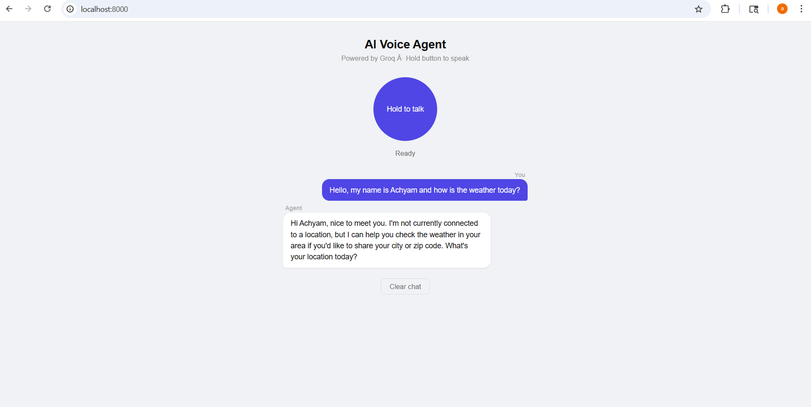

URL:  https://shopping-acting-millennium-movers.trycloudflare.com
# AI Voice Agent

A free, browser-based AI voice agent powered by **Groq API** (Speech-to-Text + LLM). Works on any phone or laptop — no app install required.

---

## How it works

```
You speak → Groq Whisper (STT) → Groq LLaMA (LLM) → Browser TTS → You hear the reply
```

- **STT** — Groq Whisper (`whisper-large-v3`) transcribes your voice
- **LLM** — Groq LLaMA (`llama-3.3-70b-versatile`) generates a reply
- **TTS** — Browser's built-in Web Speech API speaks the reply (100% free)

---

## Tech Stack

| Layer          | Technology             | Cost      |
| -------------- | ---------------------- | --------- |
| Backend        | Python + FastAPI       | Free      |
| Speech-to-Text | Groq Whisper API       | Free tier |
| LLM            | Groq LLaMA 3.3 70B     | Free tier |
| Text-to-Speech | Browser Web Speech API | Free      |
| Frontend       | HTML + JavaScript      | Free      |
| Hosting        | Railway / Render       | Free tier |

---

## Project Structure

```
ai-voice-agent/
│
├── .env                  # Your secret API keys (never commit this)
├── .env.example          # Safe template to share with others
├── .gitignore            # Excludes .env and cache files from git
├── requirements.txt      # Python dependencies
├── config.py             # Loads environment variables safely
├── main.py               # FastAPI app — routes and request handling
│
├── services/
│   ├── __init__.py       # Makes services a Python package
│   ├── stt.py            # Speech-to-Text via Groq Whisper
│   ├── llm.py            # LLM replies via Groq LLaMA
│   └── tts.py            # TTS provider selector
│
└── static/
    └── index.html        # Browser UI — works on phone and laptop
```

---

## Prerequisites

- Python 3.10 or higher
- A free [Groq API key](https://console.groq.com)

---

## Setup & Installation

### 1. Clone the repository

```bash
git clone https://github.com/your-username/ai-voice-agent.git
cd ai-voice-agent
```

### 2. Create a virtual environment (recommended)

**Windows (PowerShell):**

```powershell
python -m venv venv
.\venv\Scripts\Activate.ps1

# If you get a permissions error, run this first:
Set-ExecutionPolicy -ExecutionPolicy RemoteSigned -Scope CurrentUser
```

**Mac / Linux:**

```bash
python3 -m venv venv
source venv/bin/activate
```

### 3. Install dependencies

```bash
pip install -r requirements.txt
```

### 4. Set up your API key

Copy the example env file:

```bash
# Windows
copy .env.example .env

# Mac / Linux
cp .env.example .env
```

Open `.env` and add your Groq API key:

```
GROQ_API_KEY=gsk_xxxxxxxxxxxxxxxxxxxxxxxxxxxx
```

Get your free key at [console.groq.com](https://console.groq.com) — no credit card needed.

---

## Running the App

```bash
python -m uvicorn main:app --reload --host 0.0.0.0 --port 8000
```

Then open in your browser:

| Device            | URL                      |
| ----------------- | ------------------------ |
| Same PC           | `http://localhost:8000`  |
| Phone (same WiFi) | `http://YOUR_PC_IP:8000` |

To find your PC's local IP on Windows:

```powershell
ipconfig
# Look for IPv4 Address under your WiFi adapter
```

---

## Usage

1. Open the app in your browser
2. **Hold** the button and speak
3. **Release** to send (hold for at least 1 second)
4. Wait for the animated dots — the agent is thinking
5. Hear and read the agent's reply

> **Tip:** Allow microphone access when the browser asks — it only works with mic permission.

---

## Groq Free Tier Limits

| Model                     | Requests / day | Tokens / min |
| ------------------------- | -------------- | ------------ |
| `whisper-large-v3`        | 2,000          | —            |
| `llama-3.3-70b-versatile` | 14,400         | 6,000        |

More than enough for personal use and demos.

---

## Deploying to Railway (free)

1. Push your project to GitHub (make sure `.env` is in `.gitignore`)
2. Go to [railway.app](https://railway.app) and create a new project
3. Connect your GitHub repo
4. Add environment variable: `GROQ_API_KEY = your_key_here`
5. Set the start command:
   ```
   python -m uvicorn main:app --host 0.0.0.0 --port $PORT
   ```
6. Deploy — Railway gives you a public URL instantly

---

## Environment Variables

| Variable       | Description                             | Required |
| -------------- | --------------------------------------- | -------- |
| `GROQ_API_KEY` | Your Groq API key from console.groq.com | Yes      |

---

## Common Errors & Fixes

| Error                                  | Fix                                        |
| -------------------------------------- | ------------------------------------------ |
| `uvicorn` not recognized               | Use `python -m uvicorn` instead            |
| `ImportError: cannot import get_reply` | Check `services/__init__.py` exists        |
| `ERR_ADDRESS_INVALID` on `0.0.0.0`     | Open `http://localhost:8000` instead       |
| `Audio file is too short`              | Hold the button for at least 1 second      |
| Mic access denied                      | Allow microphone in browser settings       |
| `GROQ_API_KEY is missing`              | Check your `.env` file exists with the key |

---

## Roadmap

- [ ] Wake word detection ("Hey Agent")
- [ ] Persistent conversation memory across sessions
- [ ] Phone call support via Twilio
- [ ] Swap in ElevenLabs for higher quality voice
- [ ] Multi-language support

---

## License

MIT — free to use, modify, and distribute.
